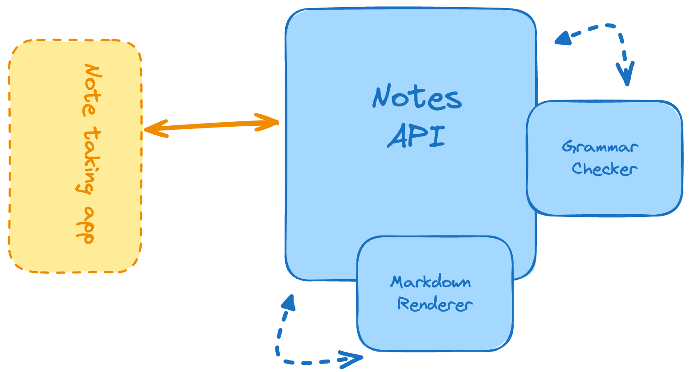
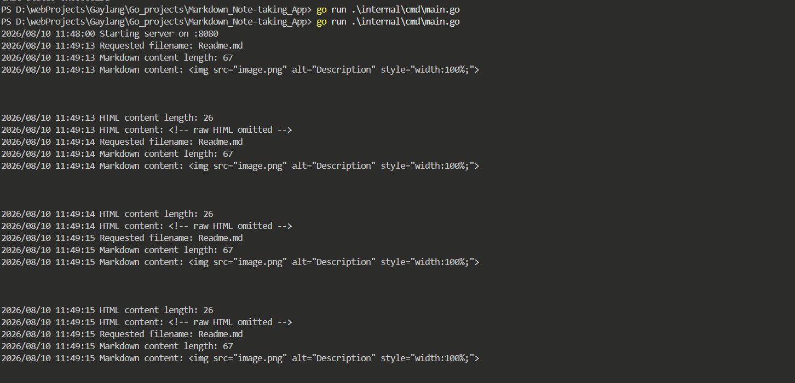

https://roadmap.sh/projects/markdown-note-taking-app

Markdown_Note-taking_App/
├── internal/
│   ├── handlers/
│   │   ├── notes.go
│   ├── routers/
│   │   ├── router.go
│   ├── services/
│   │   ├── note_service.go
│   ├── utils/
│   │   ├── grammar_checker.go
│   │   ├── markdown_renderer.go
├── templates/
│   ├── index.tmpl
├── uploads/
│   └── (uploaded markdown files)
├── .gitignore
├── .gitattributes
├── LICENSE
├── README.md
├── go.mod
├── go.sum
├── main.go